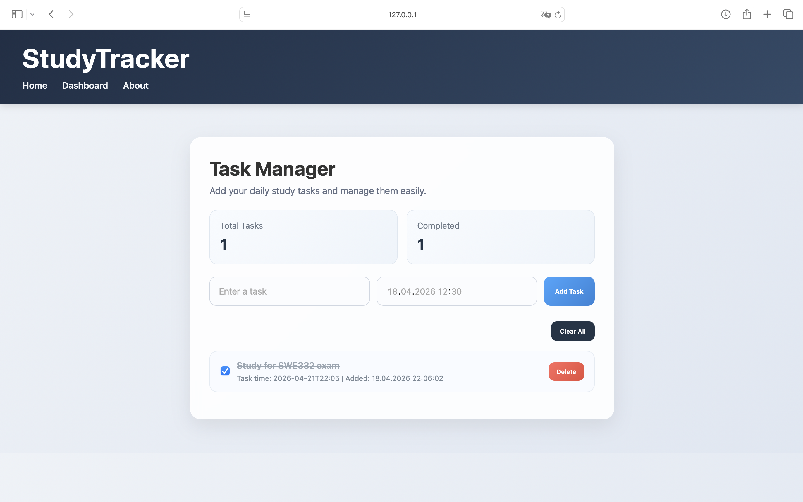

# StudyTracker

A modern web-based task management application that allows users to organize their study activities efficiently with date and time tracking.

StudyTracker is a simple web-based task management application designed to help students organize their study tasks efficiently.

## Features
- Add tasks with date and time
- Mark tasks as completed using checkbox
- Delete tasks
- Data persistence using localStorage
- Clean and user-friendly interface

## Technologies Used
- HTML
- CSS
- JavaScript

## Purpose
The aim of this project is to improve time management skills and provide a simple interface for tracking daily study tasks.

## Deployment
This project is hosted on GitHub and can be accessed through the repository.
## Screenshots

